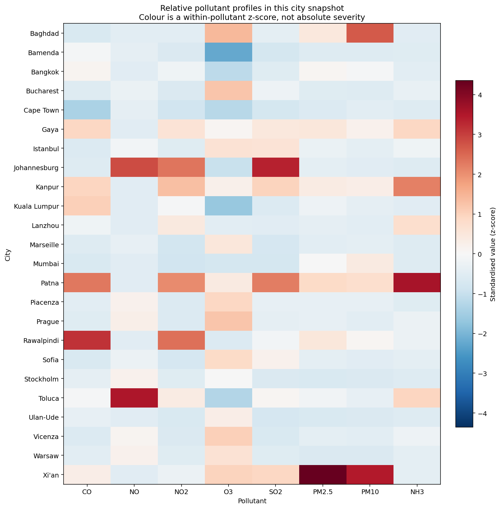
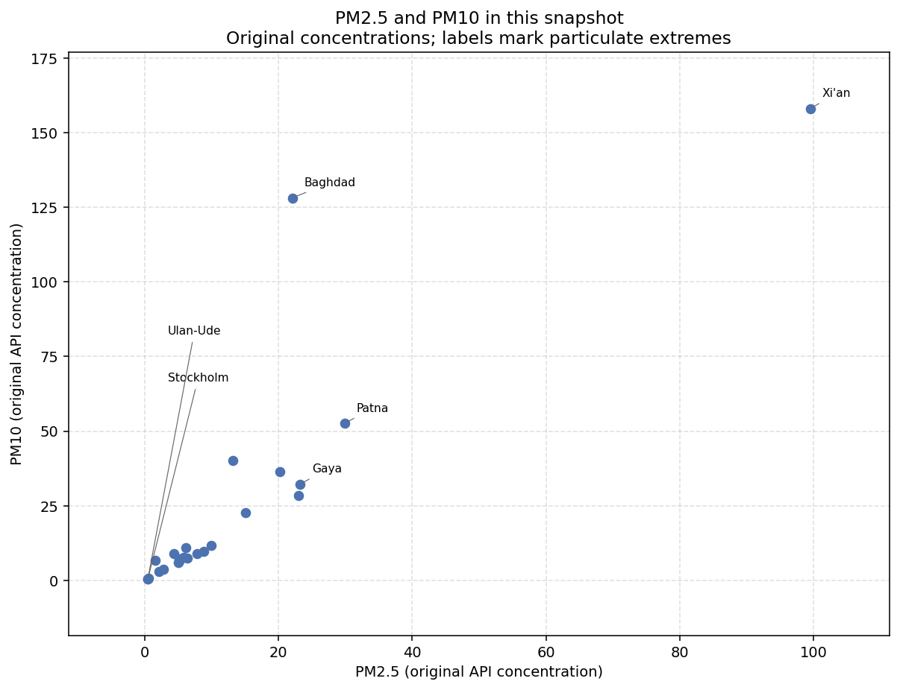
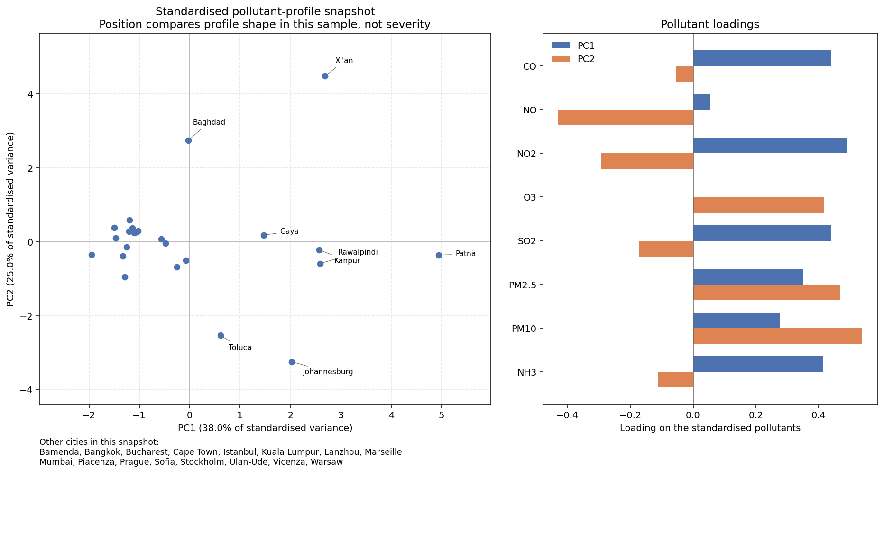
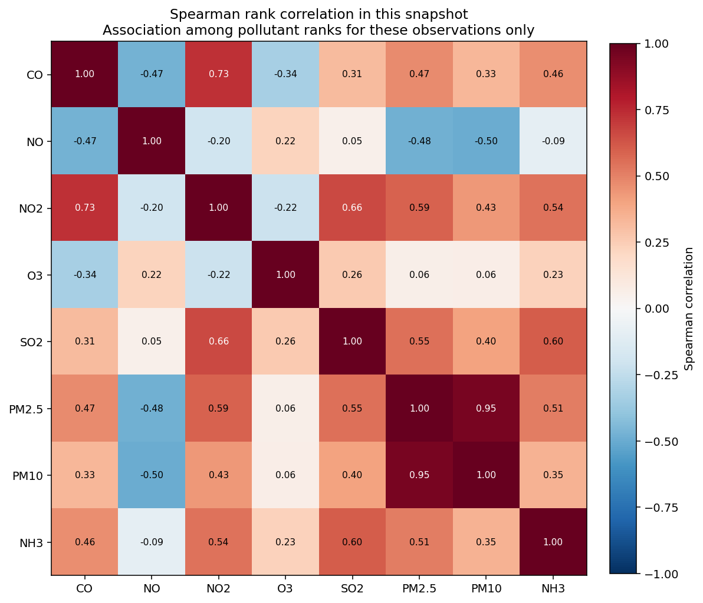

# Air Quality Data Pipeline & Exploratory Analysis

A tested pipeline that checks OpenWeather air-pollution snapshots against a canonical city table, keeps pollutant concentrations in their original units, and describes the resulting 24-city cross-section with Spearman correlation and standardised PCA.

The interesting part is the data handling. Mismatched coordinates are rejected instead of being relabelled as another city, the published table is never scaled, and the analysis stays inside what 24 observations can support.

## Snapshot

- **24** validated city observations, one row each, across **18** countries
- **8** pollutant measurements, stored in the original API units
- Collected in one session on 7 April 2026, spanning **372 seconds**
- **6** historical snapshots were rejected after coordinate checks and kept out of the published table
- **67** automated tests pass
- Standardised PCA is descriptive: PC1 **38.0%**, PC2 **25.0%**, **63.0%** together

This is one cross-section. It is not a time series, a forecast, or a ranking of cities.

## Figures

The four figures below were generated from `data/processed/air_quality_data.csv`.

### Standardised pollutant profiles

Each cell is a within-pollutant z-score for this set of cities. Red means high relative to these 24 rows. Blue means low. The colour is not an absolute severity scale.



### Particulate measurements

PM2.5 against PM10 in original units. Labels mark extremes of either particulate column, including cities that share the same minimum.



### PCA snapshot

PC1 and PC2 of the eight standardised pollutants, with loadings beside the scatter. Axis percentages come from this fit. Position describes profile shape in this sample.



### Spearman associations

Rank correlation among the eight pollutants in this snapshot. Coefficients are descriptive. PM2.5 and PM10 move together here; most other pairs are weaker and sensitive to the small sample.



## Pipeline

```text
location table
    -> local API snapshots
    -> location and observation checks
    -> rejection of invalid snapshots
    -> canonical observations in original units
    -> exploratory analysis
    -> figures
```

`data/worldwide_locations.csv` holds the canonical places: `city`, `country`, `country_code`, `latitude`, `longitude`.

Each raw snapshot is kept only when its city is in that table and both latitude and longitude are within **0.02 degrees** of the canonical coordinates. Unknown cities and coordinate mismatches are rejected. The stored JSON coordinates are not rewritten, and a rejected file is not assigned to a nearby city.

A snapshot is also rejected when it is malformed, the timestamp or AQI value is invalid, a pollutant is missing, or the same city, country, and UTC timestamp has already been accepted. Missing pollutants are dropped, not filled in.

Accepted rows keep the API concentrations. Timestamps are stored as explicit UTC. Scaling happens later, only inside the analysis functions that need it.

`python3 main.py` runs that cleaning step on local files. It does not call the API.

## Canonical dataset

`data/processed/air_quality_data.csv` is the published table.

| Column | Role |
|---|---|
| `city`, `country`, `country_code` | Place, taken from the canonical location row |
| `latitude`, `longitude` | Coordinates from the accepted snapshot |
| `timestamp_utc` | Observation time in UTC |
| `aqi` | Provider category from the same observation (1–5) |
| `co`, `no`, `no2`, `o3`, `so2`, `pm2_5`, `pm10`, `nh3` | Pollutant concentrations in original API units |

The file has 24 rows, 18 countries, no missing pollutant values, and no duplicate `(city, country_code, timestamp_utc)` keys. `aqi` is kept so the provider category can be read alongside the measurements. It is metadata from the same payload as the pollutant fields.

## Why the coordinate check matters

An earlier location table paired some city names with coordinates for a different place. Pollutant values from those responses would have been stored under the wrong city if the pipeline had trusted the filename alone.

The canonical coordinates were corrected, and each stored snapshot was checked against them. **24** snapshots matched and were kept. **6** did not, and were quarantined locally. They are not relabelled, and they are not in the published dataset. `data/raw/` and `data/rejected_raw/` stay on the machine that collected them.

That check is what stops a concentration from being attached to the wrong city.

## Exploratory analysis

The eight analysis columns are `co`, `no`, `no2`, `o3`, `so2`, `pm2_5`, `pm10`, and `nh3`. Numeric work lives in `src/analysis.py`. Figures live in `src/visualisation.py` and call those functions rather than reimplementing them.

### Standardisation

The columns are on very different scales. Carbon monoxide varies by hundreds of API units; nitric oxide varies by fractions of a unit. A distance or a covariance PCA on the raw numbers would be dominated by the large-magnitude columns.

`StandardScaler` is applied inside the analysis layer for the city heatmap and for PCA. The canonical CSV is left in original units. Nothing writes a scaled copy back over that file.

### Spearman correlation

Most pollutants in this snapshot are right-skewed, and a few cities dominate individual columns. Spearman correlation uses ranks, so those extremes have less influence than they would on a Pearson correlation.

In this file, PM2.5 and PM10 have a strong positive rank association. That is a description of these 24 rows. With eight variables and 24 observations, other coefficients can move if one extreme city is removed. The heatmap does not report significance tests.

### PCA

PCA is fit on the eight standardised pollutants. On the current table:

- PC1 accounts for about **38.0%** of the standardised variance
- PC2 accounts for about **25.0%**
- together, about **63.0%**

The scatter is a two-dimensional view of how these 24 profiles differ. Component signs are oriented so the largest loading on each component is positive, which keeps a rerun from flipping the axes. The components are not severity scores, and the picture depends on the extreme rows in this sample.

## Design choices

- Invalid snapshots are rejected. They are not quietly renamed to the nearest canonical city.
- The published table keeps original concentrations, so a reader can see the measurements the API returned.
- Standardisation stays in the analysis step, next to the methods that need a common scale.
- Spearman is the correlation shown, because the snapshot is skewed.
- PCA is used as a description of this sample.
- Raw API responses and the API credential stay out of the public repository.

## Project structure

```text
README.md
requirements.txt
main.py
config.py
src/
  __init__.py
  analysis.py
  api_client.py
  data_collection.py
  data_processing.py
  locations.py
  visualisation.py
tests/
  test_analysis.py
  test_clean_observations.py
  test_locations.py
  test_main.py
  test_processed_dataset.py
  test_visualisation.py
data/
  worldwide_locations.csv
  processed/
    air_quality_data.csv
images/
  pollutant_heatmap.png
  pm_scatter.png
  pca_snapshot.png
  spearman_correlation.png
```

## Reproducibility

Two different jobs are easy to mix up.

### Published analysis

A clone of this repository includes `data/processed/air_quality_data.csv`. That file is the input for the summaries, the correlation, the PCA, and the four committed figures.

The figures were produced from that CSV by `plot_pollutant_heatmap`, `plot_pm_scatter`, `plot_pca_snapshot`, and `plot_spearman_heatmap` in `src/visualisation.py`. There is no separate figure command.

Setup and tests:

```bash
python3 -m venv .venv
source .venv/bin/activate
pip install -r requirements.txt
python3 -m pytest tests -q
```

The current suite result is **67 passed**.

### Local collection and validation

`python3 main.py` reads JSON files from `data/raw/`, checks them against `data/worldwide_locations.csv`, and writes `data/processed/air_quality_data.csv`. It does not download data.

Those raw files, and the quarantined snapshots in `data/rejected_raw/`, are gitignored. A fresh clone does not contain them, so `main.py` cannot rebuild the committed 24-row table on its own. Run it only where the local snapshots are already present: it overwrites the processed CSV.

`src/api_client.py` and `src/data_collection.py` are the acquisition path. They expect a local API key in `config/apikey.txt`, which is gitignored and is not used by `main.py`.

## Testing

```bash
python3 -m pytest tests -q
```

The suite covers location-table checks, parsing and rejection of raw observations, the offline `main.py` path, preservation of original pollutant values, the numeric analysis, PCA shape and orientation, figure writing, and the guarantee that analysis and plotting leave their input tables unchanged.

Tests use fixtures for the rejection cases. They do not call the API and they do not need the gitignored raw files.

## Limitations

- The sample is **24** cities, one observation each.
- The clock span is **372 seconds**, so there is no trend to estimate.
- The location list is a fixed set of places, not a sample designed to represent the world.
- A few cities dominate individual pollutants. Removing one of them changes the PCA picture.
- Correlations describe this snapshot. They are not a general account of how these pollutants behave.
- `aqi` and the pollutant fields come from the same provider observation.
- The repository does not forecast concentrations, and it does not claim a causal story.
- It does not assign cities to stable types or clusters.

## Technologies

- **Python** for the pipeline, analysis, and tests
- **pandas** for tables and the canonical CSV
- **NumPy** for numeric checks inside analysis and figures
- **scikit-learn** for `StandardScaler` and PCA inside the analysis layer
- **Matplotlib** for the four figures
- **requests** for the optional API client
- **pytest** for the automated suite
